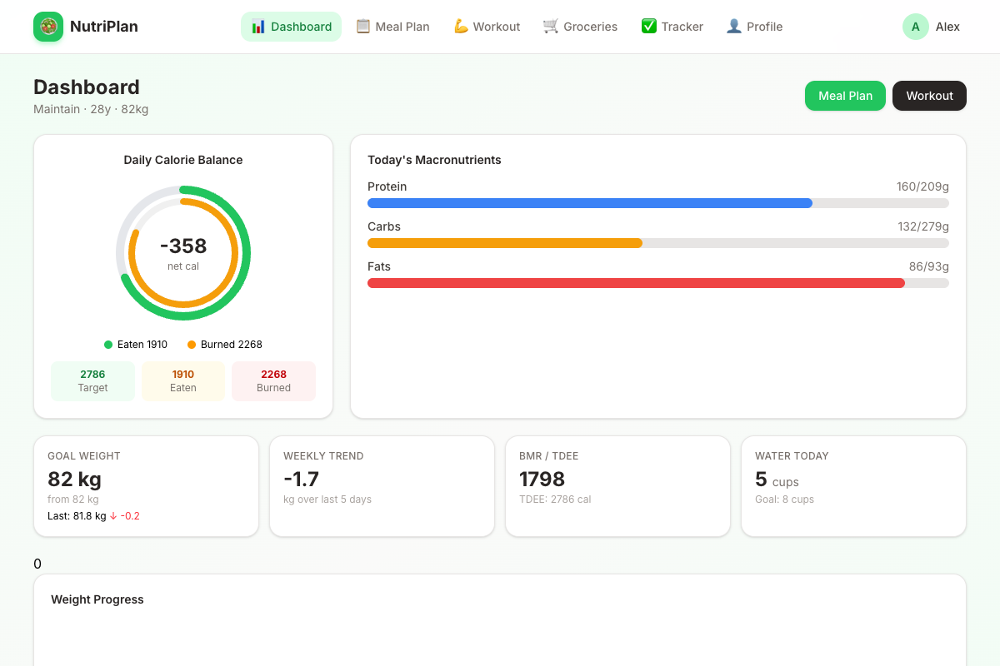
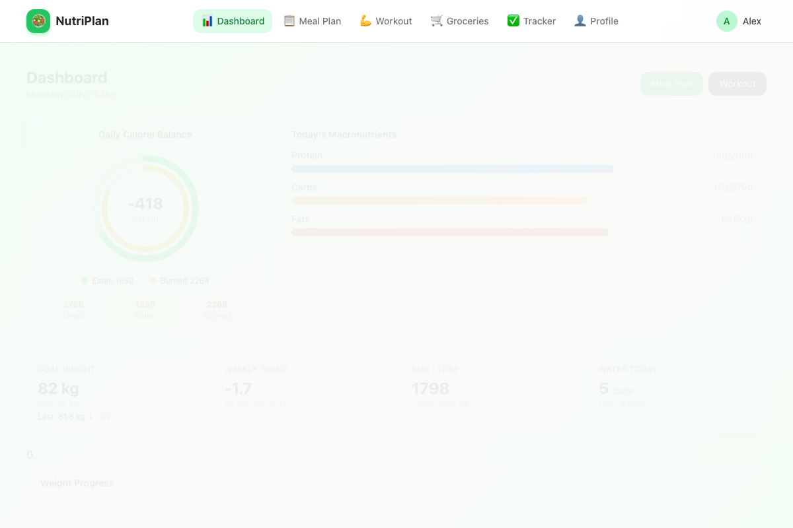
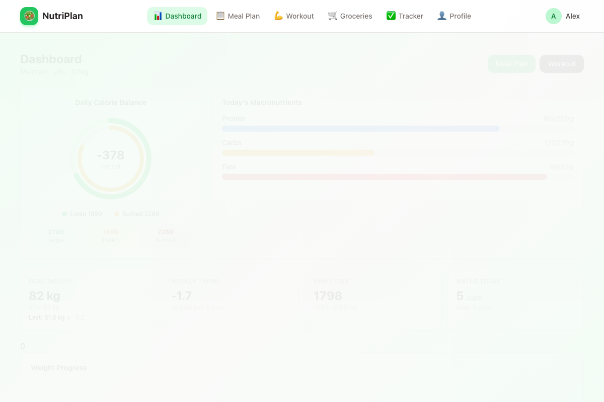
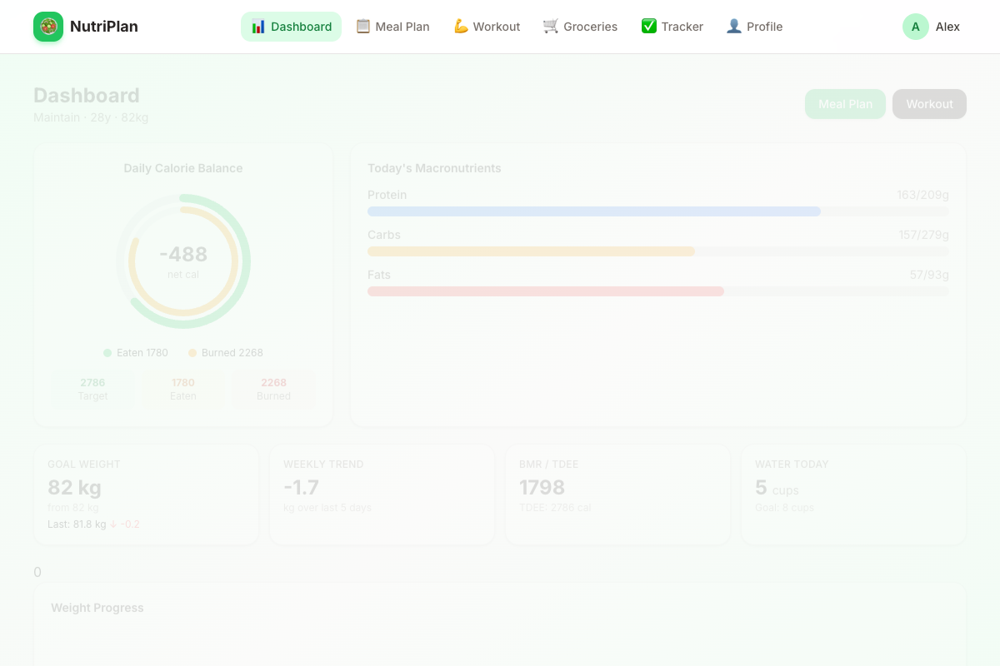
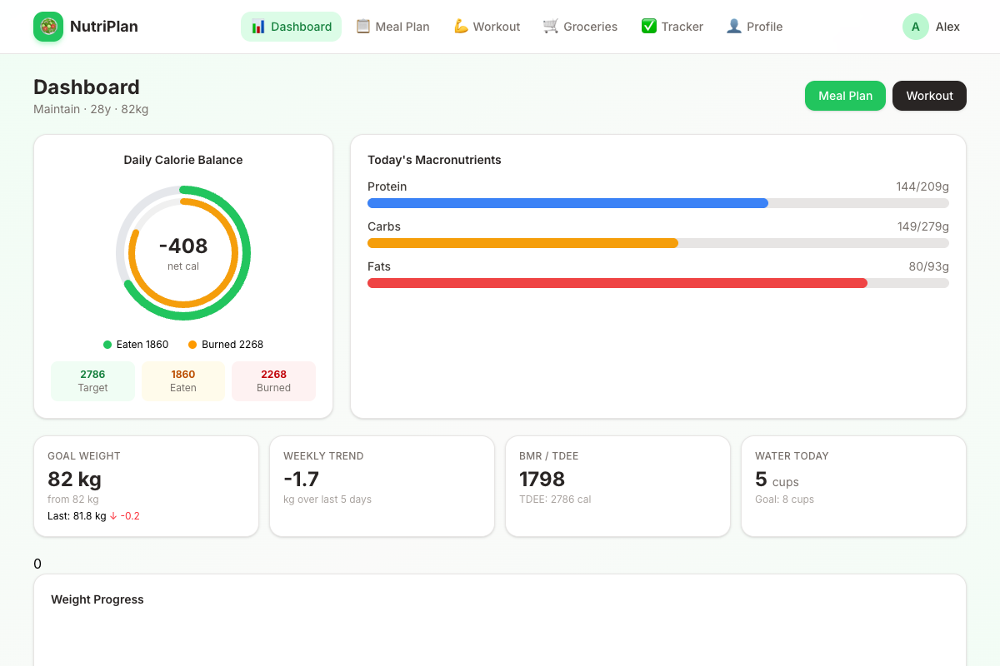
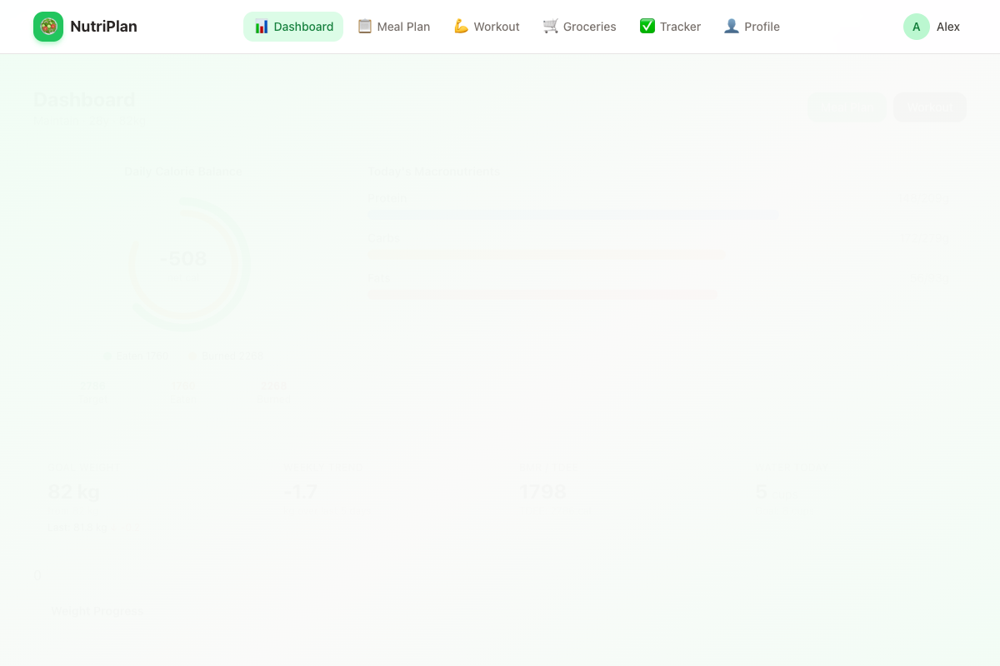

# Personal Nutrition & Meal Planner

A comprehensive React-based personal nutrition and fitness tracking application. Plan meals, track workouts, monitor macros, and achieve your health goals.

## Features

| Feature | Description |
|---------|-------------|
| 📊 **Dashboard** | Daily calorie balance, macronutrient breakdown, goal forecasting, weight tracking |
| 📋 **Meal Plan** | Generate 7-day personalized meal plans with macros, prep times, and step-by-step instructions |
| 💪 **Workout Plan** | Weekly workout splits tailored to your goal (lose weight, maintain, gain muscle) |
| 🛒 **Grocery List** | Auto-generated categorized shopping list from your meal plan |
| ✅ **Daily Tracker** | Log food intake, track water consumption, and monitor daily progress |
| 👤 **Profile** | Set fitness goals, dietary restrictions, and personalized metrics |

## Screenshots

| Dashboard | Meal Plan |
|:---:|:---:|
|  |  |

| Workout Plan | Grocery List |
|:---:|:---:|
|  |  |

| Daily Tracker | Profile Settings |
|:---:|:---:|
|  |  |

## Tech Stack

- **React 19** with Hooks and Context API
- **Vite 8** for fast development and build
- **Tailwind CSS 4** for utility-first styling
- Local-first architecture (data stored in browser localStorage)

## Getting Started

```bash
npm install
npm run dev
```

Open [http://localhost:5173](http://localhost:5173) to use the app.

## Usage

1. **Register** an account (data is stored locally in your browser)
2. **Complete your profile** — age, weight, height, activity level, and fitness goal
3. **Generate a meal plan** and view detailed recipes with macros
4. **Generate a workout plan** with exercises, sets, and rep ranges
5. **Track daily progress** — log food, water, workouts, and weight
6. **Use the grocery list** to shop for ingredients from your meal plan

## Build

```bash
npm run build
npm run preview
```
